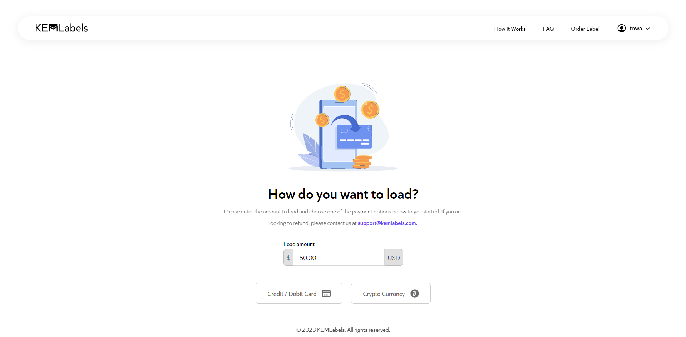

# KEMLabels

A comprehensive web application designed to provide efficient shipping and logistics solutions. Our platform allows users to easily load credits by making a deposit through Stripe or Coinbase services and purchase shipping labels either as single orders or in bulk, with a seamless credit system for transactions. With robust security and user-friendly features, KEMLabels ensures a smooth and secure experience for all users.

_Check out the live project [_here_](https://kemlabels.towaquimbayo.com/)._

## Table of Contents

* [Screenshots](#screenshots)
* [Acknowledgements](#acknowledgements)
* [Technologies](#technologies)
* [Features](#features)
  * [User Account Management](#user-account-management)
  * [Credit Management System](#credit-management-system)
  * [Shipping Label Orders System](#shipping-label-orders-system)
  * [Email Notification System](#email-notification-system)

## Screenshots

|  |  |
|:--:|:--:|
| _Sign Up Page_ | _Account Settings Page_ |
|  |  |
| _Forgot Password Page_ | _Credit History Page_ |
|  |  |
| _Load Credits Page_ | _Stripe Payment Page_ |
|  |  |
| _Order Single Label Page_ | _Order Bulk Labels Page_ |

## Acknowledgements

* Towa Quimbayo [GitHub](https://github.com/towaquimbayo) [LinkedIn](https://www.linkedin.com/in/towa-quimbayo/)
* Kian Azizkhani [GitHub](https://github.com/KianAzizkhani) [LinkedIn](https://www.linkedin.com/in/kian-azizkhani/)

## Technologies

* React.js `v18.2.0`
* CSS3
* React Accessible Accordion `v5.0.0`
* React Dropdown `v1.11.0`
* React Error Boundary `v4.0.13`
* React Helmet `v6.1.0`
* React Redux `v8.1.1`
* React Verification Input `v3.3.1`
* Redux `v4.2.1`
* Redux-Thunk `v2.4.2`
* Google Analytics (GA4) `v2.1.0`
* Stripe `v12.14.0`
* Node.js
* ADM-ZIP `v0.5.12`
* Coinbase-Commerce-Node `v1.0.4`
* Crypto `v1.0.1`
* Express `v4.18.2`
* MongoDB / Mongoose `v7.4.0`
* Multer `v1.4.5`
* Node-Cron `v3.0.2`
* Nodemailer `v6.9.3`
* Nodemon `v3.0.1`
* XLSX `v0.18.5`

## Features

### User Account Management

Ensuring secure access and comprehensive management of user accounts to protect user data and provide seamless user experiences.

* __Secure Authentication__: Users can sign up and log in with a straightforward email and password-based authentication system that requires standard information: username, email, and password. This setup, combined with HttpOnly cookies-based authentication and Mongoose (MongoDB), provides robust security to the platform, protects user data, ensures privacy, and seamless session handling.
* __Account Management__: Users can view and edit their personal information, including username, email, and password, enabling them to keep their profiles up to date.
* __Forgot Password__: Users who forget their password can easily reset it through a secure process. A 4-digit OTP (One-Time Password) token is sent to the user's registered email for verification, ensuring the validity of the request and enabling secure password reset functionality.

### Credit Management System

Conveniently load and manage credits for purchasing shipping labels.

* __Load Credits__: Users can load credits via Stripe for credit card payments or Coinbase for cryptocurrency payments for future purchases.
* __Transaction Management__:  View and manage transaction history with options to search, filter, and sort by headings, providing a comprehensive overview of credit activities.

### Shipping Label Orders System

Order shipping labels individually or in bulk with ease.

* __Single Label Orders__: Users can fill out a form with details such as courier, package class type, package details, sender, and receiver information to purchase a single shipping label.
* __Bulk Label Orders__: Download our bulk label Excel template, fill out the required fields in the spreadsheet, upload the file, and receive a ZIP file containing individual PDF labels to efficiently handle multiple shipping label orders.
* __Order Confirmation__: Receive an email with the shipping label as a PDF document for single orders or a ZIP file containing a list of PDF documents for bulk orders, ensuring users have all necessary shipping information in an organized format.

### Email Notification System

Stay informed with comprehensive email notifications.

* __Signup Confirmation__: Receive an email to confirm your account upon signup, ensuring account security and verification.
* __Purchase Notifications__: Get notified via email when purchasing shipping labels or loading credits, providing users with transaction details and confirmations.
* __Account Changes__: Receive alerts for changes to account information, such as username, email, or password, enhancing account security and user awareness.
